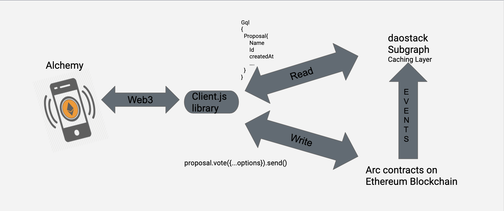

## Prerequisites

  - docker >= 18.06.1-c
  - docker-compose >= 1.22.0
  - node >= 10.16.0
  - npm >= 6.9.0
  
## Overview
  Alchemy uses [Client.js](../../stack/client/clientIntro) for 
  
  - reading/inferencing blockchain data via [DAOstack Subgraph](../../stack/subgraph/subgraphIntro)
  - writing/modifying state of [Arc contracts](../../stack/arcIntro/)

  Interaction of Alchemy with rest of the stack
  

  Following is the guide to start developing with alchemy if you are using already supported schemes by `client.js` and `subgraph`. If you have created your own `scheme contracts` for your DAO, please refer to [Add Custom Scheme support to Alchemy](../customSchemeSupportAlchemy)

## Boilerplate

    git clone https://github.com/daostack/alchemy.git
    cd alchemy
    npm ci

## Setup Alchemy with Ganache (mode: development)

    docker-compose build
    docker-compose up -d

  The above commands will build docker images and start the following services locally:

  - **alchemy** => react frontend with webpack-dev-server
  - **alchemy-server** => for storing proposal information for quick access
  - **graph-node** => for handling events from blockchain as described in subgraph
  - **ganache** => dev blockchain with some test DAOs deployed and loaded with GEN and Eth
  - **subgraph-ipfs** => subgraph mappings on ipfs node
  - **subgraph-postgres** => db for caching events based on subgraph and later fetched via GraphQL
  - **redis**
  - **alchemy-postgres**

  Import test accounts that are setup with GEN and ETH to your metamask. You can get the account details by:

    docker logs alchemy_ganache_1 | head -35

  Now your playground is ready for developing.

  TODO: Currently webpack does not detect changes in all components and rebuilds only if top-level `src/file` is changed. For now you can touch the any file in top-level and this should trigger rebuild

  NOTE:

  1. If the feature integration requires you to interact with outside contracts (e.g. uniswap widget integration might require uniswap contracts), then you can simply deploy those contracts to same `ganache` container using truffle or your own deployment script.
  2. See `Client.js` documentation for more integration details

## Setup Alchemy with Testnet (mode: staging)

  Often Ganache does not behave same as production. If you want to setup Alchemy for interacting with testnet and check before you submit PR,
  then after the boilerplate steps -
  

  Choose from one of the following setup for testnet to start playing/integrating features to Alchemy:
  
  - [Use daostack rinkeby subgraph](#use-daostack-rinkeby-subgraph)
  - [Run graph-node locally](#run-graph-node-locally)

  
  NOTE: 
  
  1. Alchemy only shows `daos` that are registered via `DAOregistry` and tracked by daostack subgraph for the respective network. You can send the `.json` of your DAO details to us (contact Nave Rachman, telegram: @NaveRachman) and we will help you.

  2. Since above process of registering DAO takes up to 24hrs in following section we provide way to hack it during development

### Use daostack rinkeby subgraph

  Choose this if,

  - using rinkeby testnet
  - working with existing whitelisted DAOs on daostack subgraph

  Make following changes:

  1. Update `docker-compose.yml`

     - remove link to `graph-node` in service `alchemy`
     - remove services `graph-node`, `ipfs`, `postgres4graphnode` and `ganache`

  2. Update `webpack.docker.config.js`

     - Change `NODE_ENV` from `development` to `staging`

  3. Build and run
        
          docker-compose build
          docker-compose up -d

### Run graph-node locally

  Choose this if,

  - using any of the already supported schemes by client & alchemy
  - playing with DAO you just deployed to any of the testnet and not yet whitelisted by daostack and registered with DAOregistry

  NOTE: 
   
   1. You can also deploy subgraph to graph explorer. `Step 1 & 2` will be replaced by [deploy to graph-explorer](https://github.com/daostack/subgraph#deploy-subgraph)
   and `Step 4` will be updated to corresponding url

   2. Alchemy only shows `daos` that are registered via `DAOregistry`. In order to bypass this during development, make changes in `src/components/Daos/DaosPage.tsx`:
      
        // original
        arc.daos({ where: { name_not_contains: "Genesis Alpha", register: "registered" }, orderBy: "name", orderDirection: "asc"})

        // changed to
        arc.daos({ where: { name_not_contains: "Genesis Alpha" }, orderBy: "name", orderDirection: "asc"})

  Make following changes:

  1. Clone subgraph repo and start-graph node locally

        git clone git@github.com:daostack/subgraph.git
        cd subgraph
        npm i

  2. Setup `.env` file and run rinkeby graph node

        // Following are example values please change for customization
        network="rinkeby"
        subgraph="daostack"
        postgres_password="letmein"
        ethereum_node="https://rinkeby.infura.io/v3/e0cdf3bfda9b468fa908aa6ab03d5ba2"

        npm run docker:run-rinkeby 

  2. Update your DAO details in `daos/rinkeby/<DAO-Name>.json` and deploy subgraph

        npm run deploy '{  "migrationFile" : "../migration.json" }'
        
  3. Go back to directory `alchemy`
        
  4. Update `docker-compose.yml`

        - remove link to `graph-node` in service `alchemy`
        - remove services `graph-node`, `ipfs`, `postgres4graphnode` and `ganache`

  5. Update `webpack.docker.config.js`, add following process variables

        'ARC_GRAPHQLHTTPPROVIDER': JSON.stringify('http://127.0.0.1:8000/subgraphs/name/daostack'),
        'ARC_GRAPHQLWSPROVIDER': JSON.stringify('ws://127.0.0.1:8001/subgraphs/name/daostack'),
        'ARC_IPFSPROVIDER': JSON.stringify('localhost')

      NOTE: If you changed name of `subgraph` while setting up `.env` in `step 1` then change it in this step accordingly
      
  6. Build and run
          docker-compose up -d

### Run graph-node locally with new/not yet supported schemes

  Choose this if,

  - using custom scheme or any arc scheme which is not yet tracked by daostack subgraph
  - adding subgraph/client support for new contract or customizing current client/subgraph
  - playing with DAO you just deployed to any of the testnet and not yet whitelisted by daostack
  - using any testnet
  
  Refer to [Add custom scheme to Alchemy](../setupCustomSchemeAlchemy)
